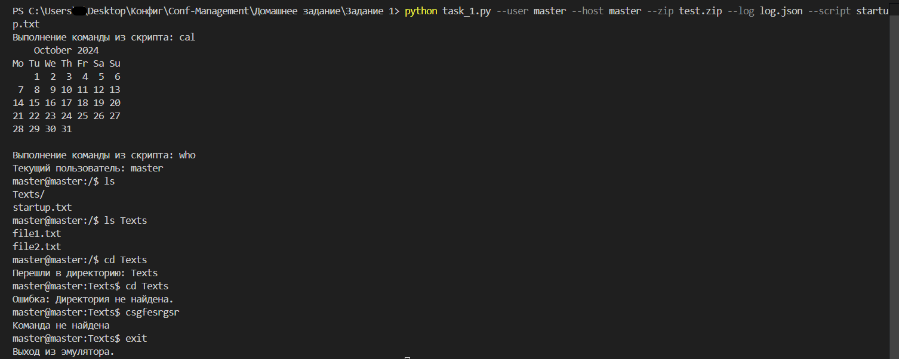
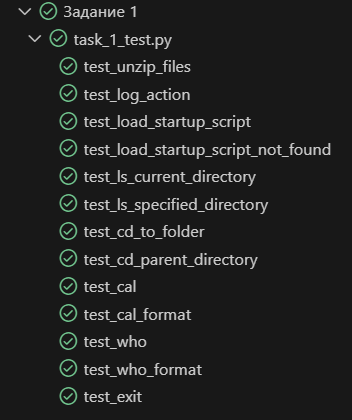
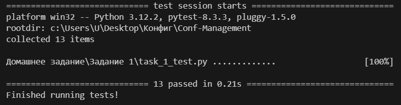

### 1. **Общее описание**

Проект представляет собой эмулятор оболочки командной строки (Shell Emulator), который обрабатывает несколько базовых команд, аналогичных Unix-командам, таких как `ls`, `cd`, `cal`, `clear`, `who`, и `exit`. Эмулятор использует файловую систему, упакованную в zip-архив, и поддерживает выполнение стартового скрипта с командами. Основное назначение проекта — демонстрация работы с zip-архивами, логирование действий, и базовая обработка команд командной строки.

В проекте реализованы:

- **Эмуляция командной строки**: Пользователь взаимодействует с программой, вводя команды в стиле Unix.
- **Работа с файловой системой**: Файловая система загружается из zip-архива, и пользователь может просматривать содержимое и перемещаться по директориям.
- **Логирование**: Все действия пользователя и результаты выполнения команд логируются в формате JSON.
- **Выполнение скриптов**: Поддерживается выполнение стартовых скриптов, содержащих команды, которые будут выполнены при запуске.

Также предусмотрены тесты, написанные с использованием библиотеки **pytest**, для проверки функциональности каждой команды эмулятора.

### 2. **Описание всех функций и настроек**

#### Класс `ShellEmulator`
Класс `ShellEmulator` реализует логику эмулятора оболочки командной строки.

- **Инициализатор `__init__(self, zip_path, log_path, username, hostname, startup_script)`**
  - Принимает путь к zip-архиву, путь к лог-файлу, имя пользователя, имя хоста (компьютера), и путь к стартовому скрипту.
  - Загружает файлы из архива, выполняет команды из стартового скрипта (если указан).

- **Функция `unzip_files(self)`**
  - Распаковывает файлы из zip-архива в словарь, где ключ — путь к файлу, а значение — содержимое файла.
  - Возвращает словарь с распакованными файлами.

- **Функция `log_action(self, command, output)`**
  - Логирует команду и результат её выполнения в формате JSON.
  - Сохраняет логи в файл по указанному пути.
  - Возвращает запись лога.

- **Функция `load_startup_script(self)`**
  - Выполняет команды из стартового скрипта, если он указан и содержится в архиве.
  - Возвращает список результатов выполнения команд.

- **Функция `execute_command(self, command)`**
  - Обрабатывает введённые пользователем команды (`ls`, `cd`, `cal`, `clear`, `who`, `exit`) и вызывает соответствующие методы.
  - Логирует каждую выполненную команду и результат.
  - Возвращает результат выполнения команды.

- **Функция `ls(self, directory=None)`**
  - Возвращает список файлов и директорий в текущей директории. Если указана директория, показывает содержимое этой директории.

- **Функция `cd(self, directory)`**
  - Меняет текущую директорию на указанную.
  - Возвращает сообщение об успешном переходе или ошибку, если директория не найдена.

- **Функция `cal(self)`**
  - Возвращает календарь текущего месяца.

- **Функция `clear(self)`**
  - Возвращает управляющие символы для очистки экрана (эмулирует команду `clear`).

- **Функция `who(self)`**
  - Возвращает имя текущего пользователя.

- **Функция `exit(self)`**
  - Завершает выполнение программы, вызывая `sys.exit()`, и логирует команду выхода.

- **Функция `run(self)`**
  - Основной цикл программы. В бесконечном цикле ожидает ввод команд от пользователя и вызывает соответствующие функции для их обработки.

#### Тесты (файл `task_1_test.py`)
Тесты написаны с использованием **pytest** и проверяют корректность выполнения команд оболочки.

- **Фикстура `shell_emulator(tmpdir)`** — создаёт тестовую среду, инициализирует эмулятор с тестовыми данными.
  
Тесты для каждой функции:
- **unzip_files**: Проверяет корректность распаковки файлов.
- **log_action**: Проверяет логирование команд.
- **load_startup_script**: Проверяет выполнение команд из стартового скрипта.
- **ls**: Проверяет вывод содержимого директории.
- **cd**: Проверяет корректность перехода по директориям.
- **cal**: Проверяет вывод календаря текущего месяца.
- **who**: Проверяет корректность вывода имени пользователя.
- **exit**: Проверяет корректность завершения программы.

### 3. **Описание команд для сборки проекта**

Проект не требует отдельной сборки, так как написан на Python. Команды для запуска скриптов:

1. **Для запуска основного скрипта `task_1.py`:**
   ```bash
   python task_1.py --user <имя пользователя> --host <имя хоста> --zip <путь к zip-архиву> --log <путь к лог-файлу> [--script <путь к стартовому скрипту>]
   ```
   Пример:
   ```bash
   python task_1.py --user master --host master --zip test.zip --log log.json --script startup.txt
   ```
   Параметры:
   - `--user`: Имя пользователя.
   - `--host`: Имя компьютера (хоста).
   - `--zip`: Путь к zip-архиву с файловой системой.
   - `--log`: Путь для сохранения лог-файла.
   - `--script`: (Необязательный) Путь к стартовому скрипту внутри архива, который будет выполнен при запуске.

2. **Для запуска скрипта с тестами `task_1_test.py`:**
   ```bash
   pytest task_1_test.py
   ```
   Этот скрипт запускает все тесты, проверяющие функциональность команд.

### 4. **Примеры использования**


### 5. **Результаты прогона тестов**

