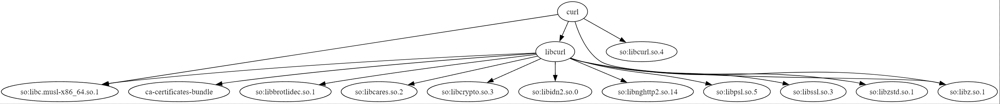

### 1. **Общее описание**

Проект представляет собой скрипт для извлечения зависимостей пакетов Alpine Linux и визуализации этих зависимостей с помощью **Graphviz**. Скрипт загружает зависимости для указанного пакета, используя веб-страницу Alpine Linux, и создает граф зависимостей, который можно преобразовать в SVG для визуализации.

Основное назначение проекта — демонстрация работы с веб-запросами, парсинга HTML с использованием **BeautifulSoup**, а также построение графов зависимостей пакетов с помощью **Graphviz**.

В проекте реализованы:

- **Извлечение зависимостей пакетов**: Автоматическое извлечение зависимостей для указанного пакета через анализ HTML-страниц.
- **Рекурсивная обработка зависимостей**: Функция собирает не только прямые зависимости, но и их зависимости, формируя полное дерево зависимостей.
- **Создание графа зависимостей**: Построение графа зависимостей в формате **Graphviz** (`.dot` файл), который затем можно конвертировать в формат SVG для визуализации.

Также предусмотрены тесты, написанные с использованием библиотеки **pytest**, которые проверяют корректность работы функций по извлечению и обработке зависимостей.

### 2. **Описание всех функций и настроек**

#### Функция `fetch_apk_dependencies`

- **Описание**:
  Функция рекурсивно собирает зависимости указанного пакета Alpine Linux, загружая HTML-страницы с официального сайта и извлекая имена зависимостей.

- **Параметры**:
  - `package_name` (строка): Имя пакета, для которого нужно получить зависимости.

- **Возвращает**:
  - Список строк, каждая из которых представляет собой имя зависимости.

- **Пример использования**:
  ```python
  dependencies = fetch_apk_dependencies('example-package')
  ```

- **Алгоритм работы**:
  1. Формируется URL на основе имени пакета.
  2. HTML-страница загружается с использованием `requests.get`.
  3. Используется `BeautifulSoup` для поиска зависимостей, указанных на странице.
  4. Для каждой найденной зависимости функция рекурсивно вызывает себя, пока не будут собраны все зависимости.

#### Функция `build_graphviz`

- **Описание**:
  Функция создает граф зависимостей пакетов в формате, который можно визуализировать с помощью Graphviz. Используется для создания визуальной репрезентации дерева зависимостей.

- **Параметры**:
  - `dependencies` (словарь): Словарь зависимостей, где ключом является имя пакета, а значением — список зависимостей этого пакета.
  - `output_file` (строка): Имя файла, в который будет записан результат в формате `.dot` (файл для Graphviz).

- **Возвращает**:
  - Функция ничего не возвращает.

- **Пример использования**:
  ```python
  build_graphviz(dependencies, 'output.dot')
  ```

- **Алгоритм работы**:
  1. Открывается файл для записи в формате `.dot`.
  2. Записывается заголовок для графа, определяющий стиль и формат.
  3. Для каждого пакета и его зависимостей формируются строки, которые описывают связи в графе.
  4. Записывается конец графа, и файл сохраняется.

#### Тесты (файл `test_task_2.py`)

Тесты написаны с использованием **pytest** и **requests_mock** для проверки работы функции `fetch_apk_dependencies`.

- **Фикстура `mock_requests`** — позволяет подменять реальные HTTP-запросы на локальные мок-ответы для тестирования.

Тесты для функций:

- **test_fetch_apk_dependencies_single_dependency**: Проверяет работу функции для случая, когда у пакета одна зависимость.
- **test_fetch_apk_dependencies_multiple_dependencies**: Проверяет работу функции для случая, когда у пакета несколько зависимостей.
  
Оба теста проверяют корректность извлечения зависимостей из HTML-страницы и корректную рекурсию при нахождении новых зависимостей.

### 3. **Описание команд для сборки проекта**

Проект не требует отдельной сборки, так как написан на Python. Команды для запуска скриптов:

1. **Для запуска основного скрипта `task_2.py`:**
   ```bash
   py task_2.py dot curl output.dot
   ```
- **task_2.py**: имя скрипта
- **dot**: путь к программе для визуализации графов
- **curl**: имя анализируемого пакета
- **output.dot**: путь к файлу-результату в виде кода

Таким образом, по итогу выполнения этой команды будет создан файл `output.svg`, содержащий визуализацию зависимостей для указанного пакета.

2. **Для запуска тестов `test_task_2.py`:**
   ```bash
   py test_task_2.py
   ```
   Этот скрипт запускает все тесты, проверяющие функциональность извлечения зависимостей пакетов.

### 4. **Примеры использования**



### 5. **Результаты прогона тестов**

