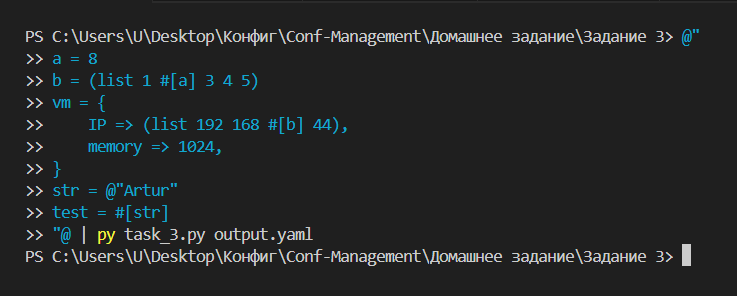

### 1. **Общее описание**

Данная программа представляет собой интерпретатор конфигурационного языка, позволяющий обрабатывать переменные, константные выражения, списки, строки и словари, определённые пользователем в формате, близком к языкам программирования. Программа поддерживает ссылки на переменные (константные выражения), многозначные массивы, и генерацию словарей, включая корректную обработку строковых данных. 

Основной результат работы программы — преобразование входных данных в формат YAML, где сохраняется структура переменных, массивов и словарей. Программа предотвращает оптимизацию YAML-сериализации (например, создание ссылок `&id001`), что позволяет получить читаемый, самодостаточный YAML-файл.

Программа включает базовую обработку ошибок:
- **`NameError`**: Если используется неопределённая переменная.
- **`FileNotFoundError`**: Если указанного выходного файла не существует.
- **Общие исключения**: Любые другие ошибки обрабатываются и выводятся с их описанием.

### 2. **Описание всех функций и настроек**

#### 2.1. Основные функции парсера

1. **`mknum`**:
   - Описание: Преобразует числовое значение в тип `float` для унификации всех чисел.
   - Возвращает: Число типа `float`.

2. **`mkarr`**:
   - Описание: Преобразует массив, заданный в формате конфигурационного языка, в список Python.
   - Возвращает: Список.

3. **`mkobj`**:
   - Описание: Преобразует словарь, заданный в формате конфигурационного языка, в Python-словарь.
   - Возвращает: Словарь.

4. **`mkstr`**:
   - Описание: Преобразует строку из формата `@"..."` в Python-строку.
   - Возвращает: Строку.

5. **`assign_const(n_v)`**:
   - Описание: Присваивает значение переменной и сохраняет в глобальном словаре `variables`.
   - Аргументы:
     - `n_v`: Кортеж, содержащий имя переменной и её значение.
   - Возвращает: Кортеж `(имя, значение)` для последующего добавления в стек.

6. **`constRes(name)`**:
   - Описание: Подставляет значение переменной из глобального словаря `variables` в выражение.
   - Аргументы:
     - `name`: Имя переменной.
   - Возвращает: Значение переменной.
   - Исключения: Генерирует `NameError`, если переменная не определена.

#### 2.2. Правила парсера

1. **`num`**:
   - Описание: Обрабатывает числа в конфигурационном языке.

2. **`name`**:
   - Описание: Определяет допустимые имена переменных (латинские буквы и цифры, начиная с буквы).

3. **`array`**:
   - Описание: Обрабатывает массивы в формате `(list ...)`.

4. **`item`**:
   - Описание: Обрабатывает пары ключ-значение для словарей.

5. **`const`**:
   - Описание: Обрабатывает объявления переменных в формате `имя = значение`.

6. **`obj`**:
   - Описание: Обрабатывает словари в формате `{ ключ => значение, ... }`.

7. **`string`**:
   - Описание: Обрабатывает строки в формате `@"..."`.

8. **`constExpr`**:
   - Описание: Обрабатывает ссылки на переменные, указанные как `#[имя]` (константные выражения).

9. **`val`**:
   - Описание: Универсальное правило для значений — число, строка, массив, словарь или выражение с константами.

10. **`main`**:
    - Описание: Точка входа парсера. Обрабатывает набор объявлений переменных и возвращает итоговый словарь.

#### 2.3. Функции для работы с файлами

1. **`parse_file(file_path)`**:
   - Описание: Считывает входные данные из стандартного потока `sys.stdin`, разбирает их с помощью основного парсера и записывает результат в файл в формате YAML.
   - Аргументы:
     - `file_path`: Путь к выходному файлу.
   - Исключения: Генерирует `FileNotFoundError`, если путь некорректен.

2. **Кастомный класс `NoAliasDumper`**:
   - Описание: Отключает ссылки и якоря в выходном YAML-файле.
   - Метод `ignore_aliases(self, data)`: Отключает генерацию ссылок YAML для всех данных.

### 3. **Описание команд для сборки проекта**

1. **Для запуска основного скрипта `task_3.py`**:
   ```bash
   @"
   <код_конфигурационного_языка>
   "@ | python task_3.py <путь_к_файлу-результату>
   ```
   - Пример команды:
     ```bash
     @"
     a = 8
     b = (list 1 #[a] 3 4 5)
     str = @"String Example"
     "@ | python task_3.py output.yaml
     ```

   После выполнения, результат будет записан в файл `output.yaml`.

2. **Пример выходного YAML**:
   ```yaml
   a: 8.0
   b:
   - 1.0
   - 8.0
   - 3.0
   - 4.0
   - 5.0
   str: String Example
   ```

3. **Для запуска тестов `test_task_3.py`**:
   ```bash
   pytest test_task_3.py
   ```
   Этот скрипт запускает все тесты, проверяющие функциональность работы парсера.

### 4. **Примеры использования**



### 5. **Результаты прогона тестов**
